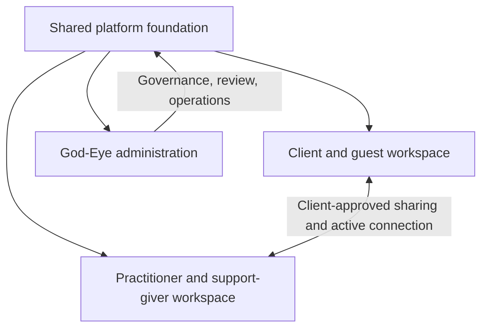

# WellnessCafe OS — Master Blueprint and Definition of Done

**Version:** 2.0 · **Reviewed:** 2026-09-25
**Status:** Living product constitution · **Roadmap authority:** this document
**Companion records:** [Phase roadmap](../roadmap/PHASE_ROADMAP.md) · [Current build log](../runtime/CURRENT_PHASE.md) · [Return-to backlog](../runtime/RETURN_TO_BACKLOG.md)

This document defines what WellnessCafe OS is, how its work is compartmentalized, what “done” means, and what build sequence we follow. The current build log records shipped work and verification; the backlog records unresolved or intentionally deferred items. Neither replaces this blueprint.

## 1. North star

WellnessCafe OS is a calm, protective operating system for recovery, everyday wellbeing, practical support, and human connection. It brings clients, practitioners, community givers, and administrators into one coordinated platform while giving each role a clear workspace and appropriate boundaries.

The product should help a person answer “What can help me now?” with a small, clear next step. A user should not need to understand the whole platform, read a wall of copy, or navigate a crowded tool catalog to get support.

WellnessCafe is not a replacement for emergency services, licensed care, diagnosis, or a practitioner’s professional judgment. It must state capabilities honestly. It must not claim that AI is always available, learns by training on users, interprets an image or face when it did not, verifies credentials it has not checked, or makes the platform HIPAA/42 CFR Part 2 compliant before formal review and operational controls exist.

## 2. Operating model: distinct workspaces, shared foundation

### Client and guest workspace

The client owns their support journey. This space includes a focused home, optional account-free entry where safe, AI guide with truthful service status, professional daily check-ins, a personal Daily Practice shelf, practical resource navigation, practitioner discovery, and client-controlled sharing/export. Optional practices are discoverable without overwhelming the default view. A practitioner may recommend a practice; the client chooses whether to add it, open it once, or dismiss it.

### Practitioner and support-giver workspace

One practitioner workspace serves reviewed providers and approved support givers across recovery coaching, peer support, therapy/counseling, yoga and movement, massage/bodywork, acupuncture, spiritual care, community organizations, and practical giving. The interface adapts to the service offered; it does not assume every provider is a clinician.

The workspace includes profile and offering management, review status, connected clients, availability and appointments, secure communication, and service-relevant support tools. A provider can recommend an existing practice to a connected client. The client retains control over adding it and over sharing progress. Practitioners see only information the client has explicitly shared for that active connection; platform staff access is separately governed and audited.

### God-Eye administration

God-Eye is the authorized operations and governance workspace. It brings together practitioner/giver application review, agent registry and controls, system health, event/audit views, risk and service status, and operational configuration. The Alpha Owner is the single trusted root administrator and is distinct from delegated administrators. Delegated administrators receive explicit, expiring responsibilities, optionally limited to named regions; they cannot grant roles or inherit God-Eye root authority. Assignment, change, and revocation require a reason and create an audit record. Each privileged server action checks the live assignment. Admin navigation must be discoverable to authorized accounts but is only a usability layer; server callables and Firestore Rules enforce access. Neither root nor delegated access opens private recovery reflections through generic profile or collection reads. Every disabled control must explain why and what is needed to enable it.

God-Eye trust and safety is accountable observability, not unrestricted surveillance. It should surface server-confirmed abuse patterns (for example repeated automated requests beyond an enforced quota), protect people immediately with scoped throttles, and queue repeated signals for an authorized human review. A signal is evidence of a system event, not proof of malicious intent or of a real-world identity. Do not infer that two accounts belong to the same person from IP address, device fingerprints, recovery content, location, or behavioral profiling. No account suspension or role/eligibility decision may be made solely from an automated risk score. Admin provisioning stays restricted to explicitly trusted administrators; ordinary users cannot self-assign admin privileges.

### Shared platform foundation

All workspaces use shared identity and authorization, consent and data-sharing rules, scheduling and messaging services, the practice catalog, resource/directory services, the agent invocation layer, audit and observability, accessible components, and a consistent theme system. Shared services do not erase role boundaries.

## 3. Product compartments

| Compartment | Owns | Key boundary |
|---|---|---|
| Identity and workspace routing | Sign-in, guest entry, role claims, account recovery, role-aware navigation | A user sees only workspaces allowed by trusted identity and policy. |
| Client support journey | Home, guide, check-ins, recovery reflections, personal practice shelf, export | Sharing is off until the client chooses otherwise; reflection is not diagnosis. |
| Practitioner network | Applications, reviewed profiles, offerings, discovery, connections, schedule, messages | Public listings are allowlisted; only active connections unlock scoped collaboration. |
| Community and practical aid | Housing, food, transport, shelter, recovery groups, donated goods/services, local navigation | Clearly label source, location, eligibility, freshness, and verification status. Never fabricate availability. |
| Practice and modality library | Breathing, movement, grounding, reflection, mindfulness, education, practitioner-shared practices | Each practice has a distinct purpose and interaction; no generic copied flow. Default client view stays curated. |
| AI and agent intelligence | Live model routing, safety routing, conversation context, agent registry, per-agent observability | `callAgent(agentId, payload)` is the only agent invocation path. Errors are not answers; no self-training claims. |
| God-Eye and platform operations | Reviews, controls, system health, events, risk visibility, audit export | Privileged access is server-authorized, least-privilege, and auditable. |
| Privacy, security, and compliance | Consent, retention, encryption, rules, audit, incident readiness, vendor controls | Clinical data is minimized and scoped. Readiness is not a compliance certification. |
| Design system and access | Navigation, typography, themes, mobile layouts, accessible interaction, plain language | High contrast, readable controls, reduced cognitive load, and consistent dark/light appearance. |

## 4. System-wide Definition of Done

A feature or release is done only when all relevant criteria below are met. A polished screen alone is not enough.

1. **Purpose and ownership:** its user, role, task, data owner, and intended outcome are clear. It belongs in the correct workspace and compartment.
2. **Working path:** every visible action has a working result, or an honest unavailable state with an actionable next step. No fake sample records, dead buttons, misleading progress, or “coming soon” presented as working product.
3. **Role and data boundaries:** server-side authorization enforces identity, ownership, active connection, consent, and admin privileges. Hiding a button is never the only protection.
4. **User control:** collection is proportionate to the task. Sensitive sharing, persistence, recording, and follow-up are explained and controlled by the person whose data is involved.
5. **Safety and truthfulness:** the interface distinguishes guidance from clinical care, real answers from service failures, reviewed from unreviewed listings, and verified capabilities from unavailable ones. Crisis actions are accurate for the user's region.
6. **Usability:** the main task is understandable at a glance, mobile-safe, keyboard and screen-reader operable, readable at common zoom, and consistent in both themes. Distress flows reduce choices and text.
7. **Reliability:** loading, empty, offline, permission-denied, validation, success, retry, and failure states are designed. Repeated submission does not create duplicate records or messages.
8. **Observability:** meaningful failures and privileged actions can be diagnosed without logging secrets, transcripts, or unnecessary sensitive content. Agent status and metrics come from the central registry.
9. **Verification:** appropriate automated checks pass; consequential role/data flows get a manual walkthrough with the right accounts. The exact tested scope and any blockers are recorded.
10. **Release truth:** deployment status, route checked, and known limitations are recorded. A build or deployment is not proof that an end-to-end workflow works for real accounts.

## 5. Compartment-level completion gates

### Client workspace

- A first-time or returning client can identify one useful next action without scanning a dense menu.
- Check-ins contain meaningful optional recovery and wellbeing prompts, save to the correct account, and clearly confirm save/failure. They are not presented as diagnosis or treatment.
- The personal practice shelf is separate from the optional library. A client can accept, open once, dismiss, and remove a shared practice.
- Real-world support searches are location-relevant, source-labeled, usable in-app, and do not strand the user on a third-party page.
- Export and deletion controls work and explain the included data and limits.

### Practitioner and giver workspace

- Application, review, profile publication, service offerings, and account role are understandable and auditable.
- Schedule supports explicit timezone selection and handles provider/client timezone differences.
- A practitioner can manage active connections and appointments; an unconnected person cannot enumerate clients or private data.
- Check-in/assessment access is scope-based and consent-led. The practitioner sees only scopes actively shared by that client.
- Recommended practices are selected from real catalog items, delivered to the intended client, and never silently installed or tracked.
- Follow-up outcomes are optional, client initiated, and limited to the information the client chose to send.
- Givers and non-clinical practitioners receive language and tools suited to their offered service; no clinical authority is implied.

### God-Eye / admin

- Authorized admin can reach the console through an obvious route and can see role-appropriate operational state.
- Admin can review practitioner and community-giver applications independently, with clear pending/approved/declined states and decision audit.
- Agent inventory, enabled state, test action, run result, latency/success metrics, and event stream use the central registry and explain unavailable controls.
- A single broken panel or lazy-loaded chunk does not blank the entire console; recoverable panels have useful retry/error states.
- Privileged user-data access is minimized, purpose-limited, and logged. The console is not an unrestricted viewer of client reflections.

### Shared platform and trust

- No client-side self-assignment of provider/admin roles; Firebase rules and callables are tested for signed-in, signed-out, owner, non-owner, connected, disconnected, and admin cases as applicable.
- Conversation/history retention and deletion match the actual storage behavior and are disclosed. Personalization is not described as model training.
- AI and external integrations have explicit identity, abuse/cost controls, safe secret handling, timeout behavior, and accurate configuration status.
- Account-abuse handling uses server-side, purpose-limited signals, bounded retention, admin-only access, and review audit. It distinguishes a Firebase account from a verified human identity and gives people a path to correct false positives.
- HIPAA and 42 CFR Part 2 are tracked as readiness programs requiring technical, contractual, and operational review; the product does not claim compliance by virtue of encryption or Firebase use.

## 6. Current position (evidence snapshot)

**The product is in cross-phase integration, with substantial Phase 3 and Phase 4 slices deployed. This is not a declaration that either phase is complete.** Recent build records show:

- Role-aware navigation, a shared dark/light appearance control, and removal of the permanent multi-destination bottom rail were deployed; route-by-route visual consistency remains open.
- The practitioner network has applications, reviewed and public-record discovery, active connections, timezone-aware schedule work, secure messaging paths, client-selected share scopes, and service-specific practice recommendations. The verified Alpha Owner can now enter the live God-Eye console; its metrics, event stream, Risk Radar, settings, review counts, and implemented agent controls loaded. A live client/practitioner two-account walkthrough remains outstanding.
- Client Daily Practice has a personal shelf for practices a practitioner shares, plus an optional collapsed catalog. Client choice and opt-in follow-up are part of the recent direction; full production walkthrough still needs two real accounts.
- Several practice routes were simplified, differentiated, themed, and checked on mobile. A complete all-tools visual/interaction audit is still open.
- Practical-support and provider directory work is deployed, with honest source labels and in-app source details. Coverage and data partnerships remain incomplete.
- Firestore rule tests and authorization work have improved, but the platform has not been certified for HIPAA or 42 CFR Part 2.

**Known unresolved or deferred work is tracked in [Return-to backlog](../runtime/RETURN_TO_BACKLOG.md).** In particular: voice/audio repair is explicitly deferred by the user; live AI reliability/configuration needs an end-to-end check; God-Eye access/runtime issues need an authorized admin walkthrough; email verification delivery remains unresolved; face-scan behavior must match actual multimodal capability; direct AI endpoint identity/cost protection and live Storage policy need security review; and any stale project-level Runtime Config value must be verified and retired before its March 2027 shutdown. The deployed Functions inventory is on Node.js 22, and the AI code no longer reads legacy Runtime Config.

The production Alpha Owner admin path is verified for the console functions listed above. That does not verify delegated-admin Rules, client/practitioner collaboration, two-account session workflows, all feature toggles, or overall HIPAA/42 CFR Part 2 readiness. Deployment and automated checks remain separate from role-separated end-to-end acceptance.

## 7. Build roadmap and exit gates

Work is grouped by OS capability rather than treating every existing phase number as a silo. Several tracks can progress in parallel, but each release must close an end-to-end user journey and its security boundary before it is called done.

### Now — Re-baseline and connect the built OS

**Goal:** establish a reliable cross-role baseline so later work is not another isolated feature loop.

- Map each route, entry point, role, backend service, and current release status into this blueprint/backlog.
- Complete a client → practitioner → admin walkthrough using authorized accounts for application review, connection, consent, practice recommendation, client choice, and optional progress follow-up.
- Repair route discovery or role claims only where the walkthrough demonstrates a real gap; preserve the user's account/session data.
- Confirm one cohesive role-aware navigation model and make unresolved areas visible as backlog rather than fake product.

**Exit:** the same deployed release can be entered by the intended roles; each role reaches the right workspace; authorization and consent behavior are demonstrated; the release record names verified and blocked journeys.

### Next — Client support journey and practice orchestration

**Goal:** deliver a coherent, low-overload client experience across home, check-in, Daily Practice, AI guide status, and real-world support.

- Prioritize clear first-step guidance, useful check-in saving, individually purposeful tools, and concise resource discovery.
- Keep practitioner-shared practices as the client's main active shelf; keep the full catalog optional.
- Test variation across ordinary questions, recovery support, offline/service-failure paths, and crisis routing. A failed AI request must never appear as a successful answer.

**Exit:** client can complete the journey without dead ends, false AI/voice claims, duplicate submissions, or unnecessary data sharing.

### Then — Practitioner network and service delivery

**Goal:** make the workspace useful across clinical, wellness, peer, and practical-giving roles.

- Complete the account/review/publication lifecycle, practical offerings, schedule, secure communication, active client workspace, and client-controlled data sharing.
- Expand public directory sources only through permitted feeds/partnerships; maintain source and review labels and an in-app detail/return path.
- Provide relevant support kits and progress follow-up without assuming every provider is a clinician.

**Exit:** a real applicant can be reviewed, approved, discovered, connected, scheduled with, and collaborate with a client under verified consent boundaries.

### Platform-wide — God-Eye and agent operations

**Goal:** restore dependable admin access and make the intelligence layer genuinely observable and controllable.

- Confirm admin claim assignment and route guards with the intended admin identity.
- Agent pause/enable controls are server-authoritative for the five implemented production agents; every change is audited and the AI handler enforces the same state. Remaining work: verify live admin entry, review the complete event/health/risk surfaces, and implement real handlers before exposing the other registered agents as testable controls.
- Separate operational metrics from sensitive client content. Preserve audit export without exposing unnecessary PHI.

**Exit:** an authorized admin can reliably review applications, inspect agent and system health, run a test, change permitted settings, and see an auditable outcome.

### Platform-wide — Trust, privacy, and production readiness

**Goal:** harden identity, data handling, integrations, operations, and incident response.

- Finish callable/rules/Storage review; add endpoint authentication and abuse/cost controls; verify email delivery and account recovery.
- Maintain auditable consent, retention/deletion, encryption/key management, vendor agreements, breach response, and access review.
- Complete a formal HIPAA and 42 CFR Part 2 gap assessment before making any compliance claim.
- Keep Firebase Functions dependencies current. Node.js 22 and `firebase-functions` 7.4.0 are deployed; AI handlers use Secret Manager and no source `functions.config()` calls remain. Verify and retire any stale project-level Runtime Config value before the March 2027 shutdown.

**Exit:** documented security and privacy review, passing relevant authorization tests, observable production controls, operational procedures, and qualified compliance sign-off where applicable.

### Finish — Product quality, accessibility, launch, and extensibility

**Goal:** make all role spaces feel like one polished, accessible OS and support future services safely.

- Complete route-by-route dark/light theme, responsive layout, plain-language, keyboard/screen-reader, contrast, and error-state reviews.
- Remove residual placeholder copy, inert controls, duplicate actions, and inconsistent navigation.
- Maintain extension points for new provider categories, resources, practice modules, and agents without bypassing authorization, consent, or observability.
- Re-run release checklist and verify the actual deployed site, not only the local build.

**Exit:** launch gates pass for each supported role and critical journey; known limitations are explicit; new modules can be added without weakening system-wide controls.

## 8. Prioritization rules

When choosing the next build, order work by: (1) safety/privacy/security risk, (2) whether a person is blocked from a core journey, (3) cross-role value and backend integration, (4) accessibility and cognitive load, then (5) feature expansion and visual polish. Avoid polishing a disconnected leaf screen while its parent journey, permissions, or operational status is unknown.

Every proposed tranche should identify the affected roles and compartments, its measurable exit gate, dependencies, and what remains deferred. Prefer one complete vertical slice with validation over several shallow screens. Do not reopen the audio work until the user resumes it or the currently agreed deferral condition is met.

## 9. Roadmap maintenance

- Update **this file** when vision, role boundaries, completion gates, or stage ordering changes.
- Update `PHASE_ROADMAP.md` when execution sequence changes.
- Update `CURRENT_PHASE.md` after a meaningful implementation/release, recording tests, deployment, route checked, and any blocked real-account walkthrough.
- Update `RETURN_TO_BACKLOG.md` when an unresolved item is discovered, deferred, resumed, or verified.
- A phase is complete only when its exit gate is evidenced. “Built”, “deployed”, and “verified end-to-end” are separate statuses.

**Immediate next build after this roadmap:** continue the client support journey across personal Daily Practice and real-world assistance while the separate practitioner test account is prepared. Then close the cross-role integration baseline with the client/practitioner/admin walkthrough and role-aware workspace entry; record account setup blockers separately from code defects.
