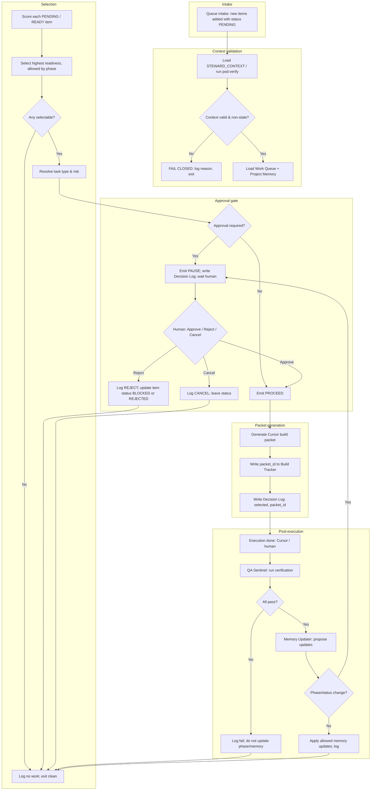

# AI App Factory — Agent Architecture

Canonical architecture for the Work Queue Executor and AI App Factory agent layer. Semi-autonomous: agents read memory, score work, prepare packets, update logs, and route tasks; the system **pauses for human approval** at major gates and **fails closed** when context is stale, incomplete, invalid, or missing.

--------------------------------------------------

## 1. System overview

| Layer | Responsibility | Automation boundary |
|-------|----------------|---------------------|
| **Work Queue** | Intake tasks; hold candidates; status lifecycle | Agents may append, update status, score. |
| **Executor** | Poll queue; validate context; score readiness; select next; generate packet; log | Agents run fully within contract. |
| **Approval Gate** | Evaluate task type and risk; emit PROCEED / PAUSE / REJECT | Human required for PAUSE resolution. |
| **Cursor / execution** | Consume build packet; perform work; return result | Human or Cursor; executor only produces packet. |
| **Build Tracker** | Record run, packet_id, result, verification outcome | Agents may append; no delete. |
| **Decision Log** | Audit trail for selection, gate decision, failure | Append-only; agents write. |
| **Project Memory** | TODAY.json, CURRENT_PHASE; steward context | Per memory contract; phase/status change requires approval. |

--------------------------------------------------

## 2. Work Queue Executor lifecycle

The executor is the single process (or workflow) that: (1) validates pod context, (2) loads work queue and project memory, (3) scores each candidate, (4) selects the next valid task, (5) checks approval gate, (6) generates a Cursor build packet or pauses, (7) logs every decision and failure.

--------------------------------------------------

## 3. Agent roles (mapped to executor steps)

| Role | Executor step | May run automated | Requires human |
|------|---------------|-------------------|----------------|
| **Vision Reader** | Load and parse steward context | Yes | No |
| **App Architect** | Derive allowed/prohibited from CURRENT_PHASE + TODAY | Yes | No |
| **Readiness Scorer** | Score queue items; select next valid task | Yes | No |
| **Approval Gate** | Emit PROCEED / PAUSE / REJECT | Yes (evaluate) | Yes (resolve PAUSE) |
| **Work Packet Generator** | Produce Cursor build packet | Yes | No |
| **QA Sentinel** | Run verification scripts after execution | Yes | No |
| **Memory Updater** | Propose TODAY / CURRENT_PHASE updates | Yes | Yes if phase/status change |
| **Logger** | Write Decision Log, Build Tracker | Yes | No |

--------------------------------------------------

## 4. Readiness scoring model

Used to select the **next valid task** from the work queue. Only items with status `PENDING` or `READY` are scored. Items in `BLOCKED`, `REJECTED`, `IN_PROGRESS`, `DONE`, or `CANCELLED` are not selected.

### 4.1 Inputs per queue item

- `task_type` (enum): determines base eligibility and approval rules.
- `phase_match`: true if item’s `target_phase` or `phase_hint` matches app’s current phase (from steward context).
- `dependencies_met`: true if any `depends_on` task_ids are in `DONE` or not present.
- `blocked_work`: false if task scope does not intersect CURRENT_PHASE prohibited list.
- `priority`: numeric or enum (e.g. P0, P1, P2); higher = prefer.
- `created_at` / `updated_at`: used for tie-break (e.g. older first for fairness).

### 4.2 Readiness score (0–100)

| Factor | Weight | Condition | Contribution |
|--------|--------|-----------|--------------|
| Phase match | Required | phase_match === true | If false, score = 0 (ineligible). |
| Dependencies | Required | dependencies_met === true | If false, score = 0. |
| Prohibited work | Required | blocked_work === false | If true, score = 0. |
| Priority | 0–40 | P0=40, P1=30, P2=20, P3=10 | Add to score. |
| Recency / staleness | 0–30 | Item not stale; optional bonus for aligned with TODAY.focus | Add to score. |
| Context alignment | 0–30 | Task scope aligns with allowed_work from CURRENT_PHASE | Add to score. |

**Selection:** Among items with score > 0, choose the one with **highest score**. Tie-break: lower `created_at` (oldest first), then by `task_id` lexicographic.

### 4.3 Ineligible (score = 0)

- Phase mismatch.
- Dependencies not met.
- Task scope in prohibited work.
- Status not in [PENDING, READY].
- Stale or invalid steward context (executor must not select; fail closed).

--------------------------------------------------

## 5. Human approval gate model

The gate evaluates each **selected** task (and later each **proposed memory update** that changes phase/status) and returns one of:

| Gate outcome | Enum | Meaning |
|--------------|------|---------|
| **PROCEED** | `PROCEED` | No human required; executor may generate packet or apply memory update. |
| **PAUSE** | `PAUSE` | Executor must stop and wait for human: Approve, Reject, or Cancel. |
| **REJECT** | `REJECT` | Executor must not proceed; log reason; do not generate packet; do not apply update. |

### 5.1 When to emit PAUSE (task selection)

- `task_type` in [PHASE_ADVANCE, RELEASE, DEPLOY, CRISIS_AUTH_CHANGE, FIRST_TIME_AUTOMATION, CONSTITUTIONAL_CHANGE].
- `approval_required` === true on the queue item.
- Custom rule per app (e.g. WellnessCafe: any change to crisis or assistance access).

### 5.2 When to emit REJECT (task selection)

- Steward context stale or invalid.
- Task scope intersects prohibited work.
- Dependencies not met or phase mismatch (should not be selected; defensive REJECT if reached).

### 5.3 When to emit PAUSE (memory update)

- Proposed write changes `phase`, `status`, or `active_phase` in TODAY.json or equivalent.
- Proposed phase closeout or advance in CURRENT_PHASE.

### 5.4 When to emit PROCEED

- Task type is routine (e.g. BUGFIX, FEATURE, DOCS, VERIFY) and no risk flags.
- Memory update only touches allowed fields (e.g. focus, notes, blocked_work, valid_today) and no phase/status change.

--------------------------------------------------

## 6. Fail-closed conditions

The executor **must not** proceed (must exit or pause and log) when any of the following is true:

1. **Steward context missing:** STEWARD_CONTEXT.json not found or not loadable.
2. **Steward context invalid:** integrity.all_required_present !== true, or all_non_empty !== true, or today_json_valid !== true, or steward_context_version missing.
3. **Steward context stale:** (now - generated_at) > max_context_age_minutes, or integrity.stale === true.
4. **Work queue not loadable:** Work Queue sheet or source missing, malformed, or not readable.
5. **No selectable task:** After scoring, every candidate has score 0 or status not in [PENDING, READY]. Executor exits clean (no packet); may log "no work."
6. **Approval gate returns REJECT:** Do not generate packet; log; update item status to REJECTED or BLOCKED per policy.
7. **Verification failed:** After execution, QA Sentinel reports fail. Do not mark task DONE; do not advance phase; do not apply phase/status memory updates.
8. **Memory contract violation:** Proposed write targets a prohibited file or field. Do not apply; log; REJECT.

--------------------------------------------------

## 7. Human approval boundaries

| Boundary | Who decides | Agent action |
|----------|-------------|--------------|
| **Task selection** | Executor (score + gate). If PAUSE, human Approve/Reject/Cancel. | Executor presents task + packet summary; human clicks Approve / Reject / Cancel. |
| **Packet execution** | Human or Cursor executes packet. | Executor only produces packet; does not run Cursor. |
| **Phase advance** | Human must approve. | Memory Updater proposes; Approval Gate emits PAUSE; human approves write. |
| **Release / deploy** | Human only. | Executor never triggers deploy; separate release process. |
| **Constitutional / manifest edit** | Human or governance only. | Executor never writes MASTER_VISION_BLUEPRINT, CURSOR_MEMORY, DoD, PHASE_ROADMAP, manifest. |

--------------------------------------------------

## 8. Logging requirements

- **Decision Log:** Every executor run must append: run_id, timestamp, step (context_loaded | scored | selected | gate_result | packet_generated | verification_result | memory_proposed), task_id (if any), packet_id (if any), gate outcome (PROCEED | PAUSE | REJECT), and on failure: failure_reason.
- **Build Tracker:** On packet generation, append: build_id, packet_id, task_id, app_id, created_at, status (PACKAGED). After execution: update same row with executed_at, verification_status (PASS | FAIL), memory_updated (boolean).
- **Fail-closed events:** Every fail-closed condition must be logged to Decision Log with step = context_validation_failed | no_selectable_task | gate_reject | verification_failed | memory_reject and failure_reason.

--------------------------------------------------

## 9. Phase 1 scope only

Phase 1 includes:

- Single app pod: **WellnessCafe** only.
- Work Queue: one canonical sheet or JSON source; schema as in SHEET_SCHEMA_STANDARD.
- Executor: one workflow (e.g. n8n) that implements load → validate → score → select → gate → packet generation → log. No multi-app scheduler.
- Approval: human in the loop for PAUSE; no automated approval.
- Memory: only TODAY.json and CURRENT_PHASE.md updates per memory contract; no new memory stores.
- Cursor: executor produces build packet; human or separate process runs Cursor with that packet. Executor does not invoke Cursor.

Phase 1 explicitly does **not** include:

- Multi-app queue or cross-app prioritization.
- Automated Cursor invocation from executor.
- Automated phase advance without human approval.
- New agent implementations beyond what is specified in this doc and the execution contract.
- Changes to product code or UX beyond what is required to support the factory docs and schemas.

--------------------------------------------------

END OF DOCUMENT
